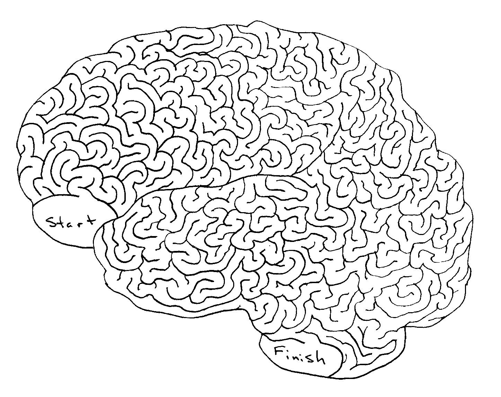
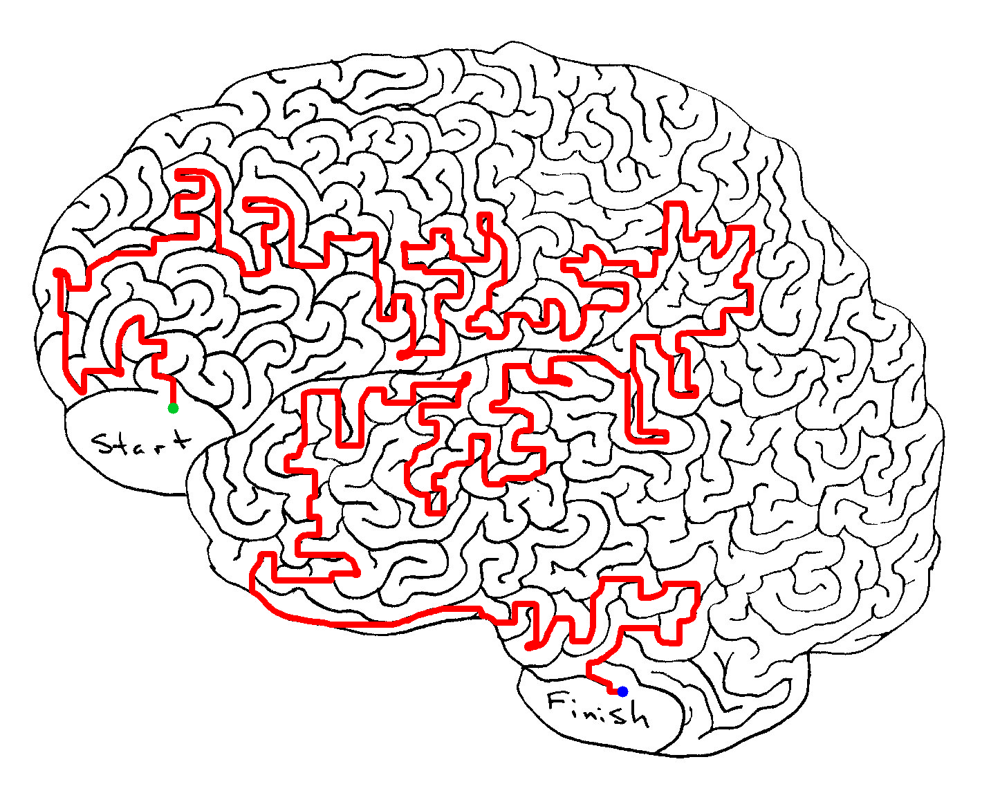

# MazeSolver
Goal: create a program that intakes a user's unsolved maze image and start and finish coordinates and produces solution image. 
Example:



### How To Run
```console
foo@bar:~$ python3 main.py <path_to_image> <xStart,yStart> <xEnd,yEnd> <DebugOption(0/1)>
```
